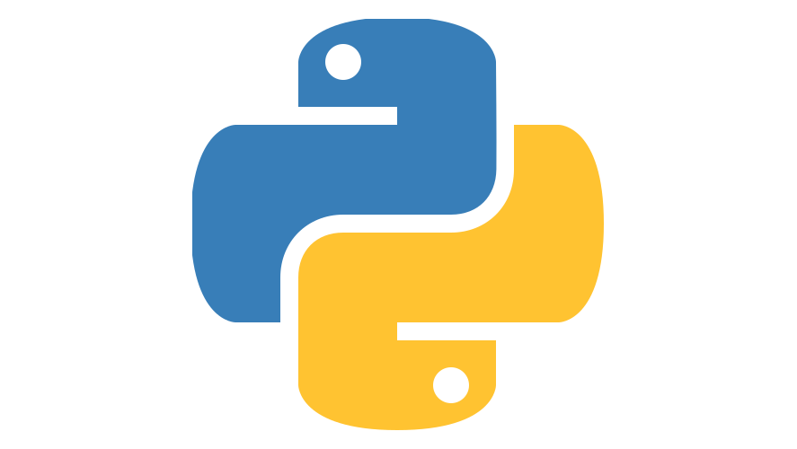
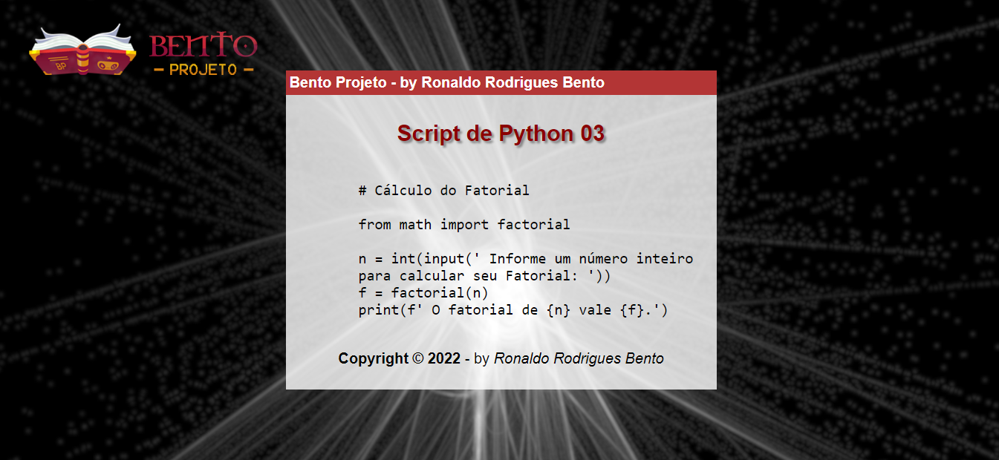

# aulas-de-python 
# Exercícios Básicos de Python 03
# Lógica de Programação

<p> Na realidade um programa é um conjunto de milhares de instruções que indicam ao computador, passo a passo, o que ele precisa fazer. Logo, um programa nada mais é do que um algoritmo computacional descrito em uma linguagem de programação, no caso, utilisando a  simplicidade da linguagem Python que possui um enorme potencial não apenas como uma linguagem poderosa de programação, mas como uma  ferramenta para mudar o seu futuro como desenvolvedor...</p><br>

## Como Executar um Script Python?

<br>

<p>Para instalar o Python no seu sistema operacional Windows, você precisa baixar o instalador. Acesse o site oficial <a href="https://www.python.org/downloads/" target="_blank">neste link</a> e clique em download.</p>

<p>Para executar um script Python na linha de comando, ele precisa estar gravado em um arquivo com a extensão “.py”. Abra o prompt de comando no Windows, ou o terminal no Linux/MacOS, e digite python nome do arquivo.py lista de argumentos. Para que isso funcione, o interpretador Python precisa estar instalado na máquina e seu caminho deve estar configurado na variável PATH, fazendo com que o arquivo executável python esteja acessível a partir da linha de comando.</p>

 ## IMPORTANTE: ##
 
 <p align="center">Você tem todo o direito de usar esse material para seu próprio aprendizado. Espero que seja útil o conteúdo disponibilizado.</p><br>

<br>

### Lista de exercícios com aproximadamente 150 exercícios de Python 03


```pytho
# Enunciado: Jogo de Adivinhação com direito a Palpites 
# Programa Desenvolvido em Python 03
'''Crie um programa (jogo) onde o computador vai "Pensar" em um número entre 0 e 10. O jogador vai tentar adivinhar até acertar, ou seja, o programa termina se o jogador acertar.No final mostra quantos palpites foram necessários para vencer.'''

print()
print('-='*40)
print(f'\033[1;34m{"Jogo de Adivinhação":^80}\033[m')
print('-='*40)
print()

from random import randint
from time import sleep

computador = randint(0,10)

print('\033[1;36m O computador pensou em um número entre 0 e 10\n será que você consegue adivinhar qual foi ele?\033[m ')
print()
acertou = False
palpites = 0

while not acertou: # Enquanto não acertar
    jogador =int(input('\033[1;37m Qual é seu palpite?\033[m '))
    palpites += 1
    if jogador == computador:
        acertou = True
    else:
        if jogador < computador:
            print('\033[1;33m O número é Maior... Tente novamente!\033[m')
        elif jogador > computador:
            print('\033[1;32m O número é Menor... Tente novamente!\033[m')
print()
sleep(1)
print(f'\033[1;37m Acertou com {palpites} tentativas.\033[m\033[1;35mPARABÊNS!\033[m')       

print()
print('-='*40)
print(f'\033[1;33m{"Programa Finalizado com Sucesso":^80}\033[m')
print('-='*40)
print()

```

```python
# Enunciado: Analisador Completo
# Programa Desenvolvido em Python 03
'''Desenvolva um programa que leia o nome, idade e o sexo de 5 pessoas. No final, mostre: A média de idade do grupo. Qual é o nome do homen mais velho. Quantas mulheres têm menos de 20 anos.''' 

print()
print('-='*40)
print(f'\033[1;36m{"Analisador Completo":^80}\033[m')
print('-='*40)
print()

soma_idade = 0
maior_idade_homem = 0
media_idade = 0
nome_homem_velho = 0
mulher20 = 0

for p in range(1,6):
    print(f'\033[1;32m >>> Analisando {p}º Pessoas:\033[m ')
    nome = str(input('\033[1;37m Informe o nome completo: ')).strip().upper()
    idade = int(input(' Informe a idade: '))
    sexo = str(input(' Informe o sexo[M/F]:\033[m' )).strip().upper()
    soma_idade += idade 
    if p == 1 and sexo in "M":
        maior_idade_homem = idade
        nome_homem_velho = nome
    if sexo in "M" and idade > maior_idade_homem:
        maior_idade_homem = idade
        nome_homem_velho = nome
    if sexo in "F" and idade < 20:
        mulher20 += 1
media_idade = soma_idade / 5

print()
print(f'\033[1;33m A Média de idade do grupo é de {media_idade:.1f} idade.\033[m') 
print(f'\033[1;37m O homem mais velho possui {maior_idade_homem} anos e se chama {nome_homem_velho}.\033[m')
print(f'\033[1;35m Ao todo são {mulher20} mulheres com menos de 20 anos.\033[m')

print()
print('-='*40)
print(f'\033[1;34m{"Programa Finalizado com Sucesso":^80}\033[m')
print('-='*40)
print()

```

